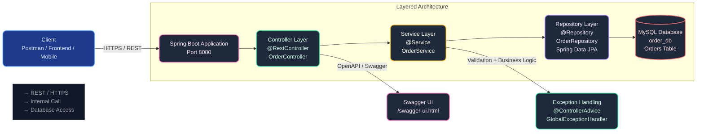
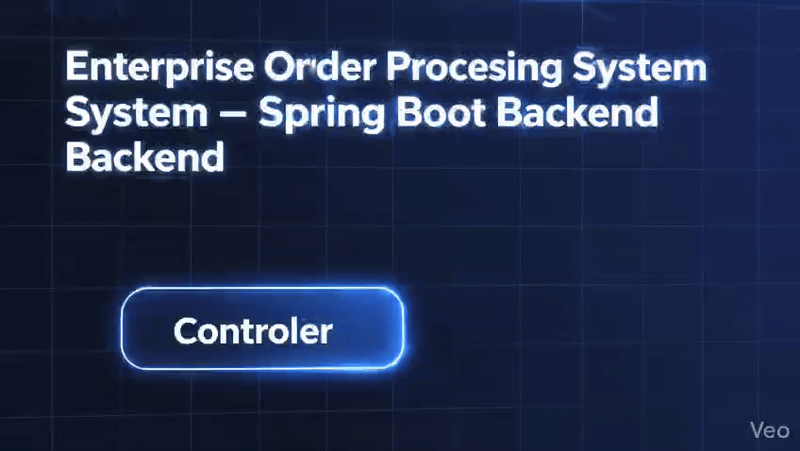
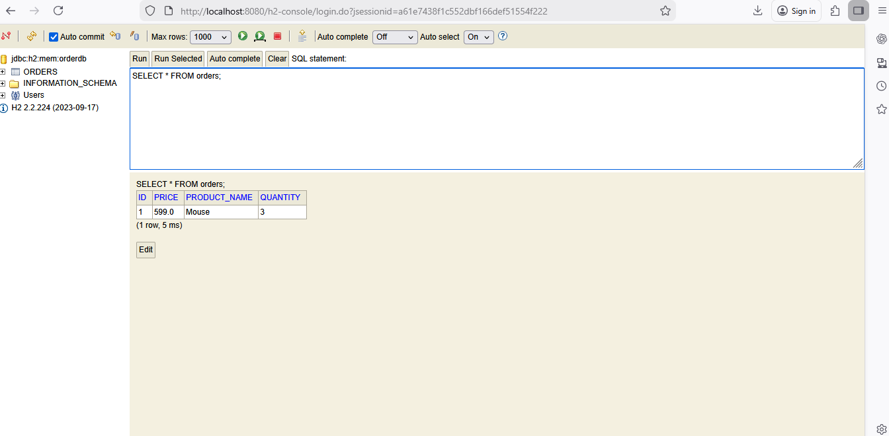
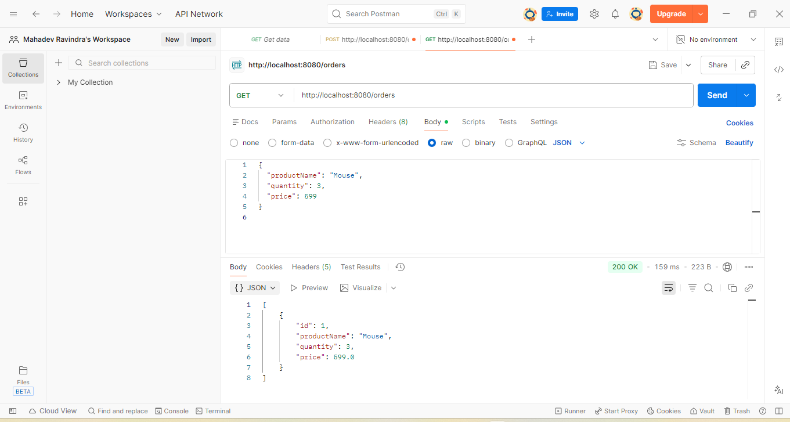
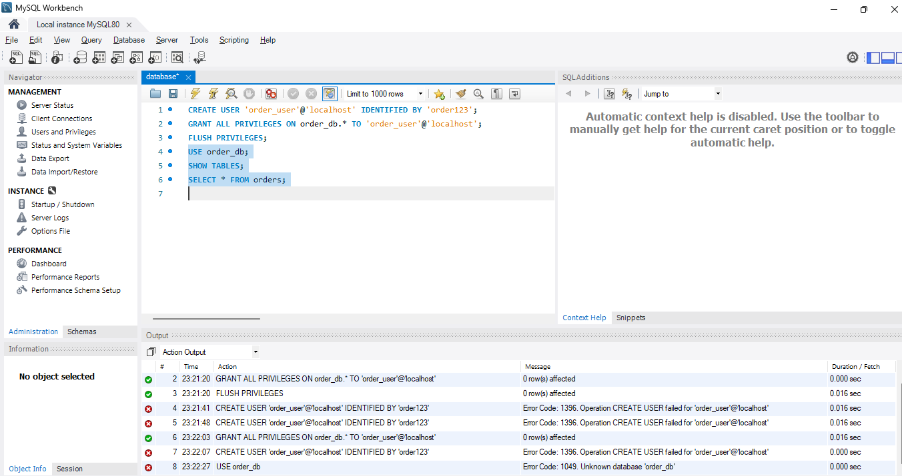

<div align="center">
  
  <br><br>

  

  <br><br>

  
  
  
  
  
</div>

<br>

# Enterprise Order Processing System

**Production-ready Spring Boot backend for managing orders in an enterprise environment**

Clean layered architecture (Controller → Service → Repository)  
RESTful APIs for order creation, retrieval & management  
MySQL persistence with Spring Data JPA  
Exception handling, validation & Swagger documentation

Ideal for:  
→ Backend developer portfolio  
→ Learning enterprise Spring Boot patterns  
→ Demonstrating real-world order workflow

## ✨ Key Features

- Create, fetch & retrieve orders by ID via REST APIs  
- Layered architecture: Controller, Service, Repository  
- Spring Data JPA + Hibernate for database operations  
- MySQL integration (also works with H2 for dev)  
- Global exception handling & input validation  
- OpenAPI 3 / Swagger UI documentation  
- Maven-based build & easy Docker support

## 🏗 Modern Architecture Overview


<h2>🚀 Demo</h2>

### 🔁 Application Flow (GIF)



---

### 🎬 Full Demo Video

[▶️ Watch Demo Video](https://github.com/Biradarmahadev/Enterprise-Order-Processing-System/blob/main/screenshots/demovideo.mp4)

---

### 🔗 Local API Endpoint (Development)

http://localhost:8080/orders


## Project Screenshots

### Create Order (HIBERNET H2)


### Fetch Orders (GET API and POST API)


### Orders Stored in MySQL


  
  
<h2>🧐 Features</h2>

Here're some of the project's best features:

*   Create new orders using REST APIs
*   Fetch all orders from the database
*   Fetch order by ID
*   MySQL database integration
*   Clean layered architecture (Controller Service Repository)
*   Uses Spring Data JPA for database operations
*   Exception handling and validation

<h2>🛠️ Installation Steps:</h2>

<p>1. Clone the repository</p>

```
git clone https://github.com/Biradarmahadev/Enterprise-Order-Processing-System.git
```

<p>2. Navigate to project directory</p>

```
cd Enterprise-Order-Processing-System
```

<p>3. Configure MySQL database in application.properties</p>

```
spring.datasource.url=jdbc:mysql://localhost:3306/order_db spring.datasource.username=root spring.datasource.password=your_password
```

<p>4. Run the application</p>

```
mvn spring-boot:run
```

<h2>🍰 Contribution Guidelines:</h2>

Contributions are welcome. Please fork the repository create a new branch and submit a pull request with clear commit messages.

  
  
<h2>💻 Built with</h2>

Technologies used in the project:

*   Java
*   Spring Boot
*   Spring Data JPA
*   MySQL
*   Maven
*   REST APIs
*   Hibernate

<h2>🛡️ License:</h2>

This project is licensed under the MIT License

<h2>💖Like my work?</h2>

If you have any questions or suggestions feel free to open an issue or contact me via GitHub.
